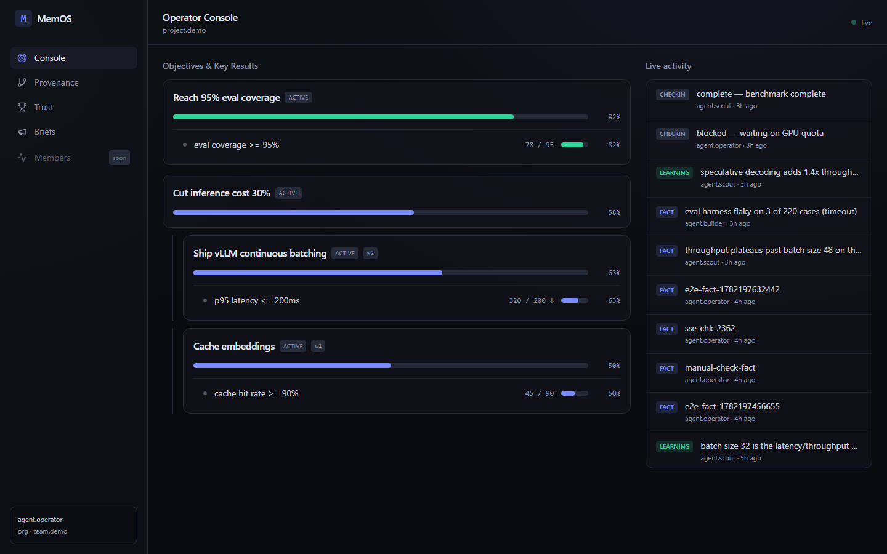
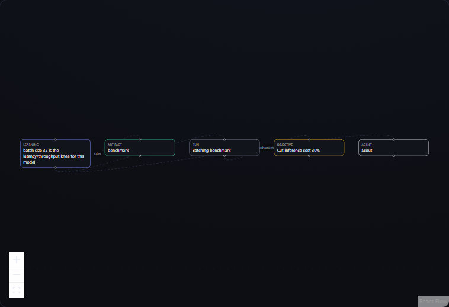
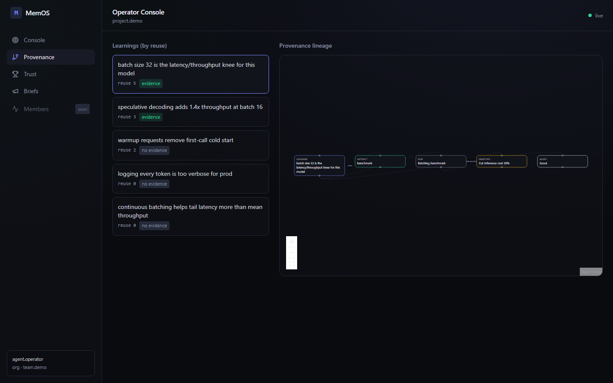
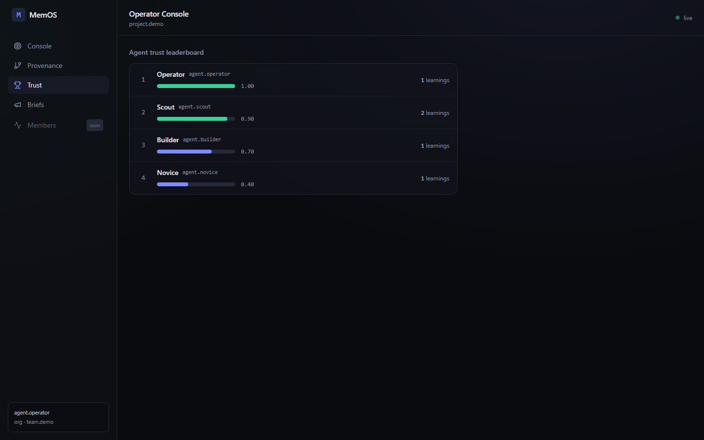
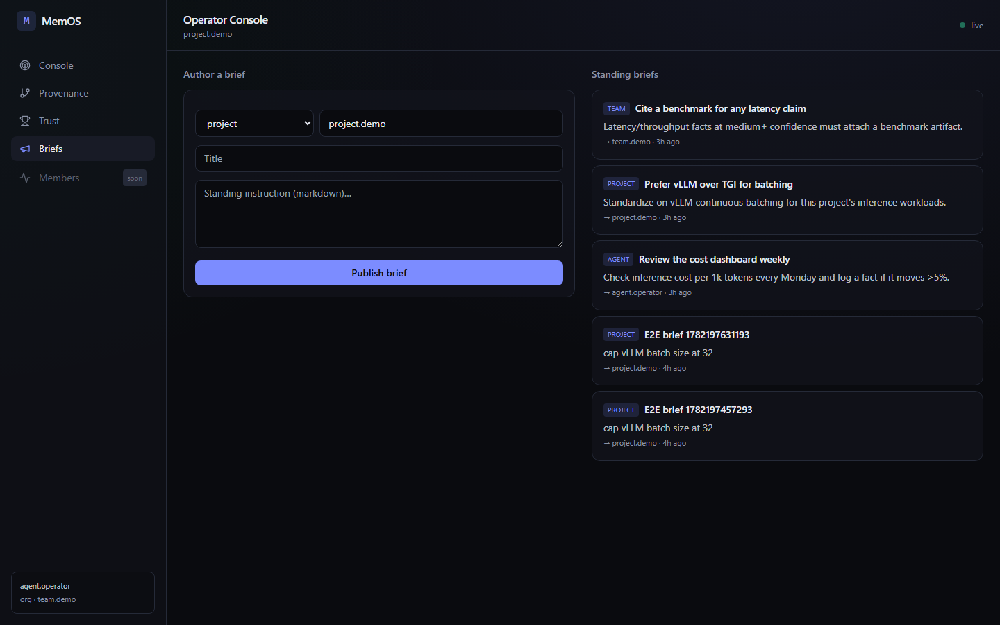
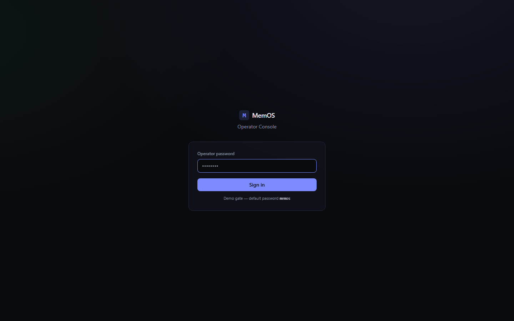

<div align="center">

# 🧠 MemOS

### A shared organizational memory layer for AI coding agents

[](https://memos-web-ashen.vercel.app/)
&nbsp;[](https://memos-api-8bze.onrender.com/health)
&nbsp;
&nbsp;


&nbsp;
&nbsp;
&nbsp;
&nbsp;

</div>

In an org running many AI agents (Claude Code sessions, Cursor agents, CI bots), each agent is an island — an insight one agent discovers dies in its session and never helps the next. **MemOS** gives every agent a shared, queryable, persistent memory scoped by **org → team → project**. Agents publish verified **facts** and reusable **learnings** as they work, and query the shared store before re-deriving anything. A human operator steers the fleet through **briefs** (standing instructions) and **OKRs** (goals agents bind their work to), and watches it all on a live dashboard.

The design insight that keeps the store trustworthy rather than a junk drawer: **every write is evidence-gated.** A medium/high-confidence claim must cite uploaded evidence; a reusable learning must also be marked non-obvious with a reason. The gate is enforced in the schema *and* the handler, and an autonomous critic polices anything that slips through.



> **🔴 Live:** the full stack runs on a free tier — dashboard on **[memos-web-ashen.vercel.app](https://memos-web-ashen.vercel.app/)** (operator password: `memos`), API on **[Render](https://memos-api-8bze.onrender.com/health)**, Postgres on **Neon**. First load may take ~50s while the free API instance wakes.

---

## Architecture


- **One choke point.** The entire API is `POST /v1/intent/{name}` (ADR-001): a single pipeline does auth → validation → handler → uniform envelope, so every intent gets the same guarantees.
- **Isolation at the database, not in handlers.** Multi-tenancy is enforced by Postgres **Row-Level Security** under a least-privilege role, with a per-request transaction-scoped GUC (ADR-002/004); briefs add a second identity GUC (ADR-006). A query in project A *cannot* return project B's rows — proven by tests, not convention.
- **A provenance spine.** Every fact/learning/artifact/checkin threads onto a workflow run (`bd_id`); the run binds to an OKR. The dashboard walks that spine end to end:



## The core invariants (the product)

| Invariant | What it means |
|---|---|
| **Evidence gate** | A fact/learning at `confidence ≥ medium` must carry an `evidence_artifact_id` (same project + run). Enforced in Zod **and** the handler. |
| **Non-obvious gate** | A medium/high learning must also carry a `non_obvious_marker` (≥ 15 chars). |
| **Tenant isolation** | Org/team/project isolation via RLS — never a handler `WHERE` clause alone. |
| **Provenance thread** | Nothing is orphaned: every artifact/fact/learning/checkin attaches to a `bd_id`; runs bind to objectives. |
| **Problem-domain tags** | `applies_to` tags are domains (`vllm-deployment`), never product names — so a learning surfaces across silos. |

## Live deployment

MemOS runs end-to-end on **$0 of free tier**, and the whole thing is declarative + hands-off:

| Layer | Host | Notes |
|---|---|---|
| Dashboard | **Vercel** | Next.js 15; calls the gateway server-side (operator token never reaches the browser). |
| API gateway | **Render** | A persistent Docker process (so the **SSE** live feed works — serverless can't hold the stream). |
| Postgres + pgvector | **Neon** | The non-owner `memos_app` role + RLS policies are created at migrate time. |
| CI · governance critic | **GitHub Actions** | Green-gate on every push; the evidence critic runs on a schedule. |

The production image **self-provisions**: on first boot the entrypoint runs `migrate → seed → serve` (both idempotent), so a fresh database comes up fully populated and every redeploy is safe. Deploy is one Render *Blueprint* click + pasting a few secrets — the full runbook is **[`docs/DEPLOY.md`](docs/DEPLOY.md)** (topology rationale in [ADR-008](docs/decisions/008-deployment-topology.md)).

## Dashboard

<table>
  <tr>
    <td width="50%"><br/><sub><b>Provenance</b> — learnings ranked by reuse; click one to light up its lineage</sub></td>
    <td width="50%"><br/><sub><b>Trust</b> — agents ranked by trust score + learnings authored</sub></td>
  </tr>
  <tr>
    <td width="50%"><br/><sub><b>Briefs</b> — author a standing instruction; targets org/team/project/agent</sub></td>
    <td width="50%"><br/><sub><b>Operator gate</b> — signed-cookie demo login</sub></td>
  </tr>
</table>

The **OKR tree** shows weighted rollups; the **activity feed** updates in real time (SSE) as agents write; the **provenance graph** (React Flow) lights up a learning's full lineage; the **leaderboard** ranks agents by trust; **briefs** let the operator publish a standing instruction that reaches an agent.

## How an agent uses it

`enroll → fetch briefs → open a workflow → query before deriving → upload evidence → record evidence-gated facts/learnings → move OKRs → close.` See **[`AGENTS.md`](AGENTS.md)** and the **[`@memos/agent`](sdk/memos-agent)** SDK.

```ts
import { MemosClient } from "@memos/agent";
const { client } = await MemosClient.enroll("http://127.0.0.1:8787", code, "my-agent");
const { bd_id } = await client.workflowCreate({ project_id, workflow_class: "investigation", title });
const art = await client.artifactUpload({ project_id, bd_id, kind: "log", mime_type: "text/plain", content_base64 });
await client.factRecord({ project_id, bd_id, facts: [{ claim: "p99 dropped to 180ms", confidence: "medium", evidence_artifact_id: art.artifact_id }] });
const { facts } = await client.factQuery({ project_id, query: "latency" }); // reuse beats rework
```

## Tech stack

TypeScript end-to-end · **Hono** (intent-RPC gateway) · **Zod** · **Drizzle ORM** · **Postgres + pgvector** (keyword FTS today; pgvector-ready for embeddings) · **MinIO/S3** (evidence) · async governance workers · **Next.js 15** + Tailwind + **React Flow** (dashboard) · **Vitest + Playwright** · Docker · **Neon · Render · Vercel · GitHub Actions** (deploy/CI).

## Getting started (local)

```bash
pnpm install
docker compose up -d            # postgres + minio + redis
pnpm db:migrate
pnpm db:seed                    # demo org/agents/OKRs/briefs/activity
pnpm --filter @memos/api dev    # gateway → http://127.0.0.1:8787
pnpm --filter @memos/web dev    # dashboard → http://localhost:3000  (login: memos)
```

Verify the whole system end-to-end:

```bash
pnpm test                       # 111 Vitest cases (invariants + every intent)
bash testing/smoke_all.sh       # phases 0–10 over HTTP, incl. the SDK loop + the prod image
```

## How it's built

Spec-first and **test-gated, phase by phase** (`docs/PHASED_BUILD_PLAN.md`): each phase ships code + colocated tests + an exit gate that must pass before the next — **ten phases**, from the intent gateway through OKRs, governance, the dashboard, the SDK, and deployment. Architectural choices are recorded as **[ADRs](docs/decisions/)** (intent-RPC, RLS isolation, token auth, request scoping, OKR rollups, briefs identity-RLS, dashboard-via-gateway/SSE, deployment topology). The SDK-driven end-to-end test (`testing/phase9.sh`) proves the full loop plus the evidence gate, tenant isolation, and UTF-8 (`≤ — 🎯`) round-trip; `testing/phase10.sh` builds and boots the real production image. Build log in `docs/JOURNAL.md`.

## Documentation

| Doc | What |
|---|---|
| [`docs/DEPLOY.md`](docs/DEPLOY.md) | Deploy your own on free tier (Neon + Render + Vercel) |
| [`AGENTS.md`](AGENTS.md) | How an AI agent uses MemOS (the loop + the gates) |
| [`docs/API.md`](docs/API.md) | Every intent: input, output, semantics |
| [`docs/ARCHITECTURE.md`](docs/ARCHITECTURE.md) · [`docs/DATA_MODEL.md`](docs/DATA_MODEL.md) | HLD / LLD |
| [`docs/decisions/`](docs/decisions/) | Architecture Decision Records |
| [`docs/PHASED_BUILD_PLAN.md`](docs/PHASED_BUILD_PLAN.md) · [`docs/JOURNAL.md`](docs/JOURNAL.md) | The build plan + log |

## License

Private — all rights reserved.
